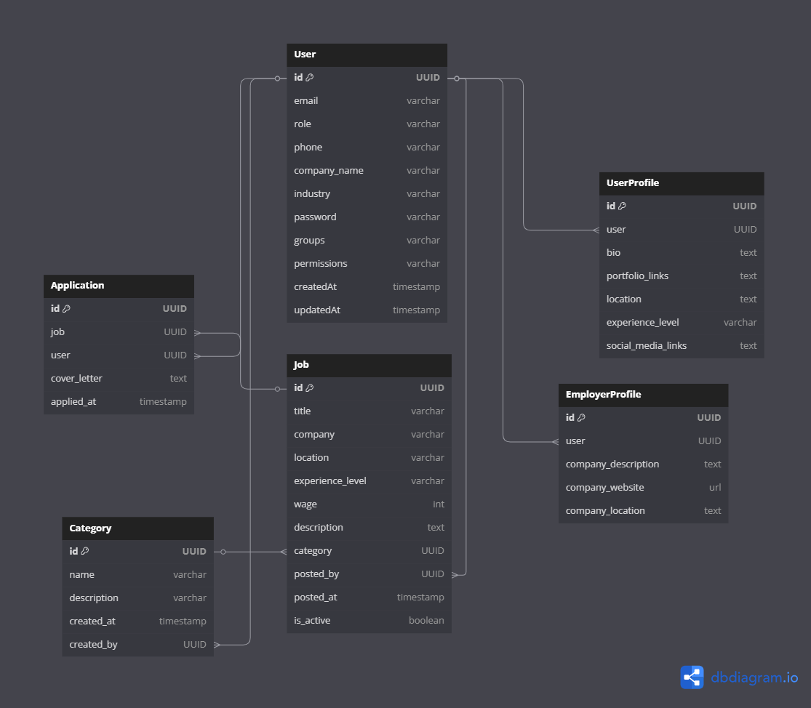

# Job Board Backend System

## Introduction
This project provides a **robust and scalable backend** for job board platforms, enabling seamless job posting, management, and application processes. It also caters for **complex role management** and **efficient data retrieval** for a real world application, integrating **advanced database optimizations** and **comprehensive API documentation** to ensure efficient performance and easy integration.

## Entity Relational Diagram


## Project Goals

### **1. API Development**

- Build RESTful APIs for managing job postings, categories, and applications.
- Ensure efficient and scalable endpoints.

### **2. Access Control**

- Implement **role-based authentication** for admins and users (job seekers).
- Secure API endpoints with **JWT-based authentication**.

### **3. Database Efficiency**

- Optimize job search queries using **indexing and query optimization techniques**.
- Implement **advanced filtering** for jobs based on location, industry, and type.

## Technologies Used

| **Technology** | **Purpose**                                                |
| -------------- | ---------------------------------------------------------- |
| **Django**     | High-level Python framework for rapid backend development  |
| **MySQL** | Database for storing job board data with optimized queries |
| **JWT**        | Secure authentication mechanism for role-based access      |
| **Swagger and Redoc**    | API endpoint documentation and testing      
| **Docker**  | Containerization for easy deployment and scalability  |               |

## Key Features

### **1. Job Posting Management**

- CRUD operations for job postings (Create, Read, Update, Delete).
- Categorization of jobs by **industry, location, and type**.

### **2. Role-Based Authentication**

- **Admins**: Manage jobs, categories, and oversee platform operations.
- **Users**: Search for jobs, apply, and manage applications.

### **3. Optimized Job Search**

- **Indexing & optimized queries** for fast filtering.
- **Advanced filtering**: Location-based, industry-based, and keyword-based search.

### **4. API Documentation**

- **Swagger and Redoc UI** for detailed API documentation.
- Hosted at `/api/docs` for frontend integration and developer reference.

### **5. Containerization & Deployment**  
- **Dockerfile** for containerizing the application.  
- **Docker Compose** to manage the database and API services.  
- Supports **scalable deployment** in cloud environments.  

## Implementation Process

### **Git Commit Workflow**

#### **Initial Setup**

✅ `feat: set up Django project with MySQL`

#### **Feature Development**

✅ `feat: implement job posting and filtering APIs`  
✅ `feat: add role-based authentication for admins and users`

#### **Optimization**

✅ `perf: optimize job search queries with indexing`

#### **Docker Integration**  
✅ `feat: add Dockerfile for containerization`  
✅ `feat: set up Docker Compose for MySQL and API service`  

#### **Documentation**

✅ `feat: integrate Swagger for API documentation`  
✅ `docs: update README with usage details`

## Deployment

The API and Swagger documentation will be hosted on pythonanywhere.
---

This backend system is designed for **scalability, security, and efficiency**, ensuring seamless integration with frontend applications. 🚀

## Expected Role based behaviour for models

## Industry Model

| User Type          | Authenticated? | GET (View) | POST (Create) | PUT/PATCH (Update) | DELETE |
|-------------------|--------------|------------|--------------|--------------------|--------|
| **Admin**         | ✅ Yes        | ✅ Allowed | ✅ Allowed   | ✅ Allowed         | ✅ Allowed |
| **Admin**         | ❌ No         | ✅ Allowed | ❌ Denied    | ❌ Denied          | ❌ Denied |
| **Employer**  | ✅ Yes        | ✅ Allowed | ❌ Denied    | ❌ Denied          | ❌ Denied |
| **Employer**  | ❌ No         | ✅ Allowed | ❌ Denied    | ❌ Denied          | ❌ Denied |
| **Regular User**  | ✅ Yes        | ✅ Allowed | ❌ Denied    | ❌ Denied          | ❌ Denied |
| **Regular User**  | ❌ No         | ✅ Allowed | ❌ Denied    | ❌ Denied          | ❌ Denied |

## Category Model

| User Type          | Authenticated? | GET (View) | POST (Create) | PUT/PATCH (Update) | DELETE |
|-------------------|--------------|------------|--------------|--------------------|--------|
| **Admin**         | ✅ Yes        | ✅ Allowed | ✅ Allowed   | ✅ Allowed         | ✅ Allowed |
| **Admin**         | ❌ No         | ✅ Allowed | ❌ Denied    | ❌ Denied          | ❌ Denied |
| **Employer**  | ✅ Yes        | ✅ Allowed | ❌ Denied    | ❌ Denied          | ❌ Denied |
| **Employer**  | ❌ No         | ✅ Allowed | ❌ Denied    | ❌ Denied          | ❌ Denied |
| **Regular User**  | ✅ Yes        | ✅ Allowed | ❌ Denied    | ❌ Denied          | ❌ Denied |
| **Regular User**  | ❌ No         | ✅ Allowed | ❌ Denied    | ❌ Denied          | ❌ Denied |


## Job Model

| User Type         | Authenticated? | GET (View) | POST (Create) | PUT/PATCH (Update) | DELETE |
|------------------|--------------|------------|--------------|--------------------|--------|
| **Admin**        | ✅ Yes        | ✅ Allowed | ✅ Allowed   | ✅ Allowed         | ✅ Allowed |
| **Admin**        | ❌ No         | ✅ Allowed | ❌ Denied    | ❌ Denied          | ❌ Denied |
| **Employer**     | ✅ Yes        | ✅ Allowed | ✅ Allowed   | ✅ Allowed (Own)   | ✅ Allowed (Own) |
| **Employer**     | ❌ No         | ✅ Allowed | ❌ Denied    | ❌ Denied          | ❌ Denied |
| **Regular User** | ✅ Yes        | ✅ Allowed | ❌ Denied    | ❌ Denied          | ❌ Denied |
| **Regular User** | ❌ No         | ✅ Allowed | ❌ Denied    | ❌ Denied          | ❌ Denied |

## Application Model
| User Type         | Authenticated? | GET (View) | POST (Create) | PUT/PATCH (Update) | DELETE |
|------------------|--------------|------------|--------------|--------------------|--------|
| **Admin**        | ✅ Yes        | ✅ Allowed | ✅ Allowed   | ✅ Allowed         | ✅ Allowed |
| **Employer**     | ✅ Yes        | ✅ Allowed (Own Jobs) | ❌ Denied  | ❌ Denied  | ❌ Denied  |
| **Regular User** | ✅ Yes        | ✅ Allowed (Own Apps) | ✅ Allowed  | ❌ Denied  | ❌ Denied  |
| **Unauthenticated** | ❌ No      | ❌ Denied  | ❌ Denied    | ❌ Denied  | ❌ Denied  |


## Installation

### Prerequisites
Before proceeding, ensure you have the following installed on your machine:
- [Docker](https://docs.docker.com/get-docker/)
- Git (optional, if cloning from a repository)

---

### Clone the Repository
If you haven’t already, clone the repository:

```bash
git clone https://github.com/Topsurpass/job_board_platform
cd job_board_platform

```

### Create .env file and supply variables
The project requires a .env file for managing environment variables.

Create a new .env file in the project root:
```bash
touch .env
```
Add the following configurations (modify as needed):
```bash
POSTGRES_DB='job_board'
POSTGRES_USER=
POSTGRES_PASSWORD=
POSTGRES_HOST='job_board_postgres_db'
POSTGRES_PORT='5432'
CELERY_BROKER_URL="redis://redis:6379/0"
CELERY_RESULT_BACKEND="redis://redis:6379/0"
CORS_ALLOWED_ORIGINS=
ALLOWED_HOSTS=
DEBUG='True'
SECRET_KEY=
USE_POSTGRES='True'

EMAIL_HOST_PASSWORD=
EMAIL_HOST_USER=
EMAIL_HOST='smtp.gmail.com'
EMAIL_PORT='465'
EMAIL_USE_TLS='False'
EMAIL_USE_SSL='True'
DEFAULT_FROM_EMAIL=
SUPPORT_EMAIL=
```

### Build and start the container
Run the following command to build and start the containers:

```bash
docker compose up --build
```

**Create suoeruser (for access to admin protected endpoint and admin dashboard)**
If you need admin access, create a Django superuser by following below commands:

```bash
# Start a bash terminal to execute commands 
docker exec -it job_board_platform-web bash

# Create superuser and Follow the prompts to enter:
Python3 manage.py createsuperuser

```

### Access the API
After setup, the API should be available at:
- API Base URL: http://localhost:8000/api/
- Admin Panel: http://localhost:8000/admin/
- Swagger API Docs: http://localhost:8000/api/docs/

**Stop the Application**
```bash
docker compose down
```